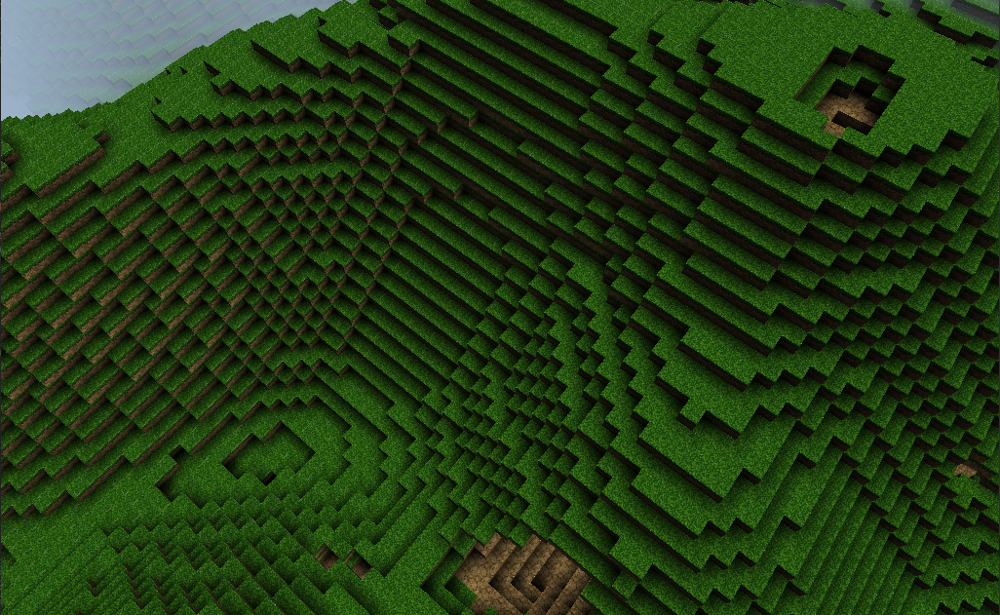
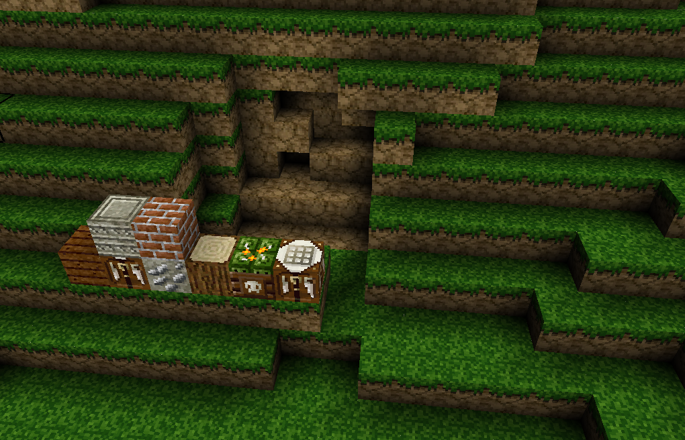

# AppGameKit-VoxelEngine

A Voxel Engine made with AppGameKit

The engine shows the basics about voxel terrain generation from different noise functions. It still under heavy development so you can expect more changes the next weeks.

## Roadmap

We are adding features by priority

- [Greedy Meshing implementation](https://github.com/jan610/AppGameKit-VoxelEngine/issues/7)
- [Load Single Images for better modability](https://github.com/jan610/AppGameKit-VoxelEngine/issues/8)
- [Save and Load the generated world](https://github.com/jan610/AppGameKit-VoxelEngine/issues/10)
- [Add a GUI](https://github.com/jan610/AppGameKit-VoxelEngine/issues/9)

## Screenshots

## Videos

https://www.youtube.com/watch?v=hGy0U2PQzpg

## Requirements

You will need a copy of [AppGameKit Classic](https://store.steampowered.com/app/325180/AppGameKit_Classic_Easy_Game_Development/) or [AppGameKit Studio](https://store.steampowered.com/app/1024640/AppGameKit_Studio/) to compile this engine.

## Discord

https://discord.gg/3skKPx2
